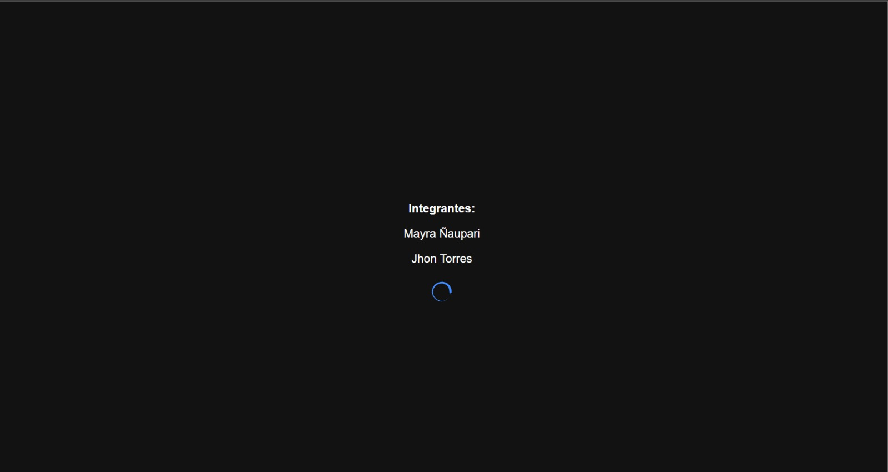
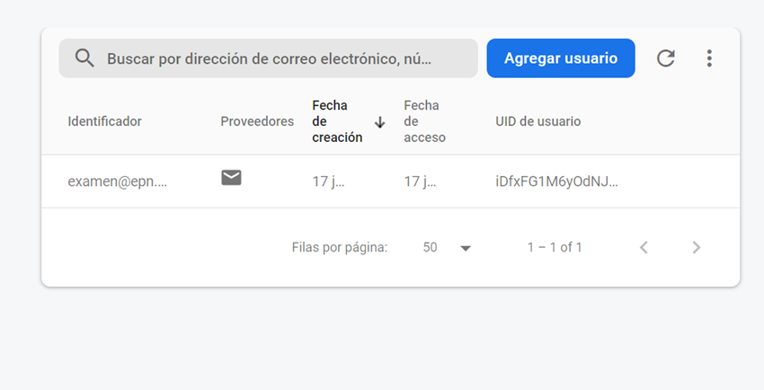

# Evaluación Ionic

# Localizador de Fotos

El presente proyecto está basado en Ionic y representa una app móvil que permite tomar una foto y guardar la foto en conjunto con la 
geolocalización. Además, debe contar con una splash screen. 

Autores:

Ñaupari Mayra
Torres Jhon

## Login de la app

## Splash Screen

## Cuenta de usuario registrado dentro de Firebase, apartado de autentificación 

## Pantalla para desplegar la cámara dentro de la aplicación

## Presentación de la cámara para proceder a tomar una foto

